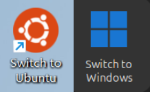

# ubuntu-windows-dual-boot-switcher

One-click reboot into the other OS on an Ubuntu + Windows dual-boot machine.
在一台 Ubuntu + Windows 双系统设备上，一键重启并直接进入另一个系统。

This project adds a desktop icon to **both** Ubuntu and Windows so that launching it reboots straight into the *other* operating system — no manual selection at the GRUB menu and no 10-second timeout wait.
本项目会分别在 Ubuntu 和 Windows 两边各添加一个桌面图标，打开它即可重启并直接进入另一个系统，无需在 GRUB 中手动选择，也无需等待 10 秒超时。

At the same time, the normal 10-second GRUB timeout is preserved for ordinary shutdowns and reboots, so you can still pick which OS to boot from the GRUB menu whenever you need to.
同时，在普通的关机/重启场景下仍保留 GRUB 的 10 秒超时，因此你随时可以在 GRUB 中自行选择要启动哪个系统。

## Requirements 使用需求

The Ubuntu and Windows boot loaders must live in the **same EFI System Partition (ESP)** and both boot through **GRUB** as the unified boot loader.
Ubuntu 和 Windows 的引导程序须位于**同一个 EFI 系统分区 (ESP)** 下，并统一通过 **GRUB** 作为启动加载器。

This is typically the case when Windows is installed first and Ubuntu is installed afterward — Ubuntu's installer then installs GRUB into the shared ESP and adds an entry for Windows.
这通常出现在先安装 Windows、再安装 Ubuntu 的情况下——Ubuntu 安装程序会把 GRUB 安装到共享的 ESP 中，并为 Windows 添加引导项。

## Installation 安装步骤

> **Important:** Install the Ubuntu side **first**; the Windows side depends on a GRUB configuration file that the Ubuntu installer creates.
> **重要提示：** 请先完成 Ubuntu 侧的安装，再进行 Windows 侧的安装，因为 Windows 侧需要依赖 Ubuntu 安装时为 GRUB 生成的配置文件。

### Ubuntu side (switch to Windows)

#### Install 安装

```bash
cd for_ubuntu/switch-to-windows
chmod +x install.sh
sudo ./install.sh
```

#### Uninstall 卸载

```bash
uninstall-switch-to-windows
```

### Windows side (switch to Ubuntu)

#### Install 安装

```powershell
cd for_windows\switch-to-ubuntu
.\install.bat
```

#### Uninstall 卸载

Simply delete the *Switch to Ubuntu* shortcut.
直接删除 *Switch to Ubuntu* 的快捷方式即可。

## License 许可

This project is licensed under the [MIT License](./LICENSE.txt).
本项目基于 [MIT 许可证](./LICENSE.txt) 开源。

The Ubuntu and Windows icon assets used in this project are trademarks of their respective owners — **Canonical Ltd.** (Ubuntu) and **Microsoft Corporation** (Windows). They are used here for identification purposes only and are **not** covered by the MIT License; all trademark rights remain with their owners.
本项目所使用的 Ubuntu 与 Windows 图标文件分别为其各自所有者的商标——**Canonical Ltd.**（Ubuntu）与 **Microsoft Corporation**（Windows）。此处仅出于识别目的使用，**不受** MIT 许可证约束，所有商标权利均归其所有者所有。
